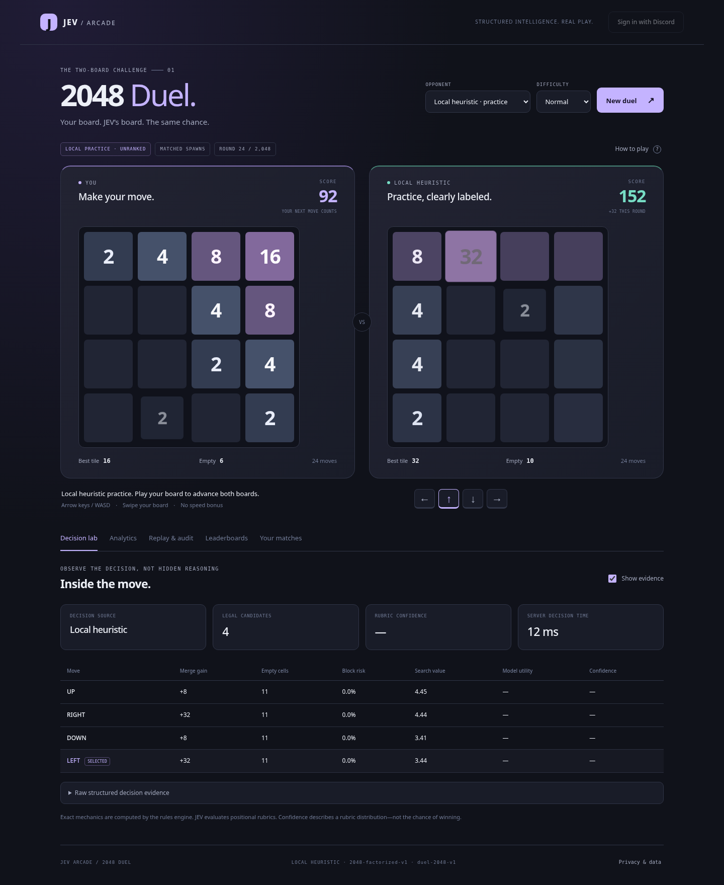

<p align="center"></p>

# JEV Arcade — 2048 Duel

A runnable, single-page 2048 duel with **separate human and opponent boards**, matched hidden randomness, a real TypeSafe/JEV HTTP adapter, Discord identity/context integration, authoritative scores, and detailed auditable analytics.

**Start here:** local heuristic practice works immediately, with no API keys or npm runtime dependencies. Live JEV and Discord require your own server-side credentials. No live JEV call, Discord authorization, or Cloudflare deployment was performed while producing this package. The provider examples are explicitly labeled synthetic; the included measured benchmark uses scripted baselines only.



## Run locally

Requires **Node.js 22.16.0 or newer** with `node:sqlite` available. The tested version is 22.16.0. An experimental SQLite warning on that version is expected.

```sh
cd jev-2048-arcade
npm start
```

Open **http://127.0.0.1:8787**. No `npm install` is needed for local execution or the Node tests. Use that exact origin rather than changing between `localhost` and `127.0.0.1`; CSRF checks bind requests to the configured origin.

The server creates `.data/arcade.sqlite` and private local signing/encryption keys on first run. These files are not part of the distributed archive. Preserve the keys with your database to replay retained encrypted seeds. To reset only your development instance, stop the server and move its `.data` directory aside.

On Windows PowerShell, the same `npm start` command works. To configure credentials, use `Copy-Item .env.example .env`; on macOS/Linux use `cp .env.example .env`.

Opening `index.html` directly as a file is not supported: the included server supplies sessions, randomness, persistence, and opponent actions even in local practice.

## What is implemented

| Area | Included behavior |
|---|---|
| Game | Separate 4×4 boards; identical starts; once-per-move merges; conventional merge score; one successful move per active board per round; matched spawns; 2,048-move cap; blocked-board continuation |
| Controls | Arrow keys/WASD in the focused play area, directional buttons, swipe gestures, immediate deterministic move preview |
| Opponents | Explicit local heuristic practice; live JEV adapter; Easy/Normal/Hard/JEV evaluation profiles; forced legal moves; bounded retry and pause; irreversible unranked downgrade |
| Evidence | Versioned manifests; exact requests and documented response fields; candidate features; rubric scores/probabilities; selected action; timing; usage; source labels |
| Integrity | Secret-seed commitment; encrypted active seed; append-only application journal; SHA-256 chain; causal parent references; server-owned transitions; replay before leaderboard publication |
| Identity | Discord authorization-code login; browser-bound one-use OAuth state; secure production cookies; minimal `identify` scope |
| Community | Signed and verified `/2048` guild-channel launch; same-user one-use token; approved text-channel allowlist; Channel/Server/World leaderboards |
| Analytics | Per-actor move and board statistics, candidate tables, heatmaps, score curves, uncertainty/latency summaries, usage completeness, retries/failures, heuristic comparison proxies |
| Portability | JSON audit bundle; JSONL event journal; CSV/JSONL analysis tables; optional Parquet conversion; offline verifier/exporter; paired-seed benchmark |
| Hosting | Built-in Node/SQLite server; Cloudflare Worker/Static Assets/D1 adapter and migration; optional Dockerfile |

There is no browser framework, tracking SDK, game engine, ORM, or npm runtime dependency. Optional development/deployment tools are explained below.

## Game semantics

Slide equal tiles together; each tile merges at most once per move. A successful move adds one tile: 2 with probability 0.9, or 4 with probability 0.1. An ineffective direction advances neither board. Reaching 2048 records a milestone but does not end the duel.

Both boards receive the same spawn value and the same uniformly shuffled position priority. The tile goes into each board's first empty cell in that priority. This preserves legal, uniform spawning even after the boards diverge. It does not force identical coordinates into differently occupied boards.

Higher final merge score wins. Equal scores draw. A blocked board freezes while the other continues. The declared ranked variant caps each board at 2,048 successful moves. There is no undo, speed bonus, hidden tiebreaker, or special attack mechanic. Resignation/expiry never publishes a high score.

Local practice is **not JEV**. Its UI and records say so. Difficulty controls its candidate-analysis depth, but its fallback move ordering remains deterministic; the four advertised JEV profiles use their own model rubric/depth configuration.

## Live JEV

Create `.env` from `.env.example`, set `TYPESAFE_API_KEY`, and restart:

```dotenv
TYPESAFE_API_KEY=your-private-key
JEV_MODEL=jev-1.13.0
JEV_TIMEOUT_MS=10000
```

Choose **JEV** as the opponent and start a duel. The server calls the documented TypeSafe endpoint with typed Score questions. Do not put the key into browser files. The pinned model ID must exist in your account; `latest` aliases are rejected. The contract was checked against public documentation and mocked responses, not against a live account.

JEV receives only its own board, remaining move budget, legal candidate afterstates, exact features, and bounded lookahead summaries. It does not receive your identity, board, pending move, seed, or future spawn. Scores and arithmetic come from code. JEV rates merge structure, space recovery, and anchor stability.

A provider failure pauses the reserved round. Retry preserves the human action. “Continue as local practice” is explicit and permanently removes eligibility; it never silently substitutes a model. Forced moves require no provider request.

## Analytics and replay

Open **Analytics** for score/space/latency curves, per-player statistics and heatmaps. Open **Decision evidence** for current legal candidates and structured model outputs. **Replay & audit** supports round-by-round inspection, verification, importing a bundle, and exports.

```sh
# Check an exported audit without contacting JEV or Discord.
npm run verify -- path/to/audit.json

# Produce normalized CSV/JSONL tables and a derived summary.
npm run export -- path/to/audit.json output-directory

# Optional: requires pyarrow, not required to play or export CSV/JSONL.
python scripts/to_parquet.py output-directory
```

The JSON bundle includes a revealed seed only after the match becomes inactive. An active export can verify recorded transitions and hash consistency, but cannot independently reconstruct the still-hidden spawn stream. The JSONL journal is an event stream, not a substitute for the complete bundle metadata/terminal seed.

See [the analytics dictionary](docs/ANALYTICS.md), [architecture](docs/ARCHITECTURE.md), and [security boundaries](docs/SECURITY.md). Model confidence is not a win probability; heuristic “regret” is a proxy, not an optimal-play guarantee; missing token usage remains unknown. Optional browser timing is off by default and is always labeled untrusted.

## Discord and deployment

See [DEPLOYMENT.md](docs/DEPLOYMENT.md) for OAuth redirect configuration, the application command, approved channels, Node HTTPS hosting, and Cloudflare setup. There are no embedded secrets or default real community IDs.

The account login uses `identify`. Guild/channel association is established separately by a signature-verified interaction and a short-lived launch token bound to the same Discord user. Browser-supplied community IDs are never accepted as proof. Community entitlement is recent launch-time context, not a continuously synchronized permission model.

Ranked play requires both Discord login and live JEV. Guests can practice and read the World leaderboard. Signing in never retroactively upgrades a guest match.

## Tests and examples

```sh
npm test
npm run test:coverage
npm run bench -- --seeds 5 --moves 128 --policies random,greedy,heuristic
```

`examples/baseline-smoke` contains **nine actually executed, verified baseline runs**: three seeds × three scripted policies, capped at 64 moves. It demonstrates the benchmark and evidence pipeline, not JEV quality. `examples/mock-provider` contains a **four-round synthetic provider-contract fixture**, deliberately labeled throughout. Its generated probability distributions and token counts are not model measurements.

See [BENCHMARKS.md](docs/BENCHMARKS.md) and [VALIDATION.md](docs/VALIDATION.md) for exact boundaries and commands. The optional browser tests need Python Playwright and Chromium; they are not runtime dependencies.

## Project map

```text
public/             Vanilla UI and shared pure rules, RNG, evaluation, audit, analytics
server/             Native Node adapter, Worker adapter, trusted API, JEV, Discord, SQLite
migrations/         Database schema, indexes, sequence guard
scripts/            Offline verification/export, optional Parquet, secrets, maintenance
bench/              Paired-seed experiment runner with durable per-run evidence
tests/              Rules, API, model contracts, security, analytics, optional browser tests
examples/           Clearly classified baseline measurements and mocked provider example
docs/               Architecture, analytics dictionary, deployment, security, validation
SOURCE_MANIFEST.json Source-input hashes; generated build identity is embedded in matches
```

## Operations and limits

Keep `.env`, `.dev.vars`, `.data`, and database backups private. Use a durable volume and HTTPS for public Node hosting. The maintenance CLI defaults to dry run; inspect it before applying retention/deletion. Preserve a replay as long as its result remains published.

```sh
npm run maintenance -- --db .data/arcade.sqlite
npm run maintenance -- --db .data/arcade.sqlite --guest-days 30 --apply
# Explicit account erasure, after backing up and stopping the server:
npm run maintenance -- --db .data/arcade.sqlite --delete-user DISCORD_ID --confirm DISCORD_ID --apply
```

Audit download and verification use paged event streaming on the server. Full analytics and browser imports still materialize the trace; use offline export for very long sessions. This release is tested application source, not a claim of independently audited production security or live deployment certification.
