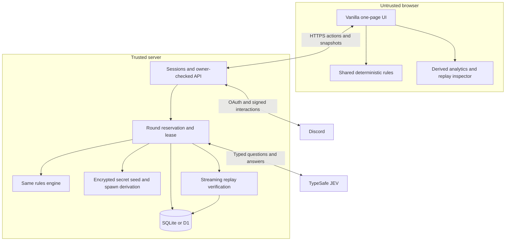
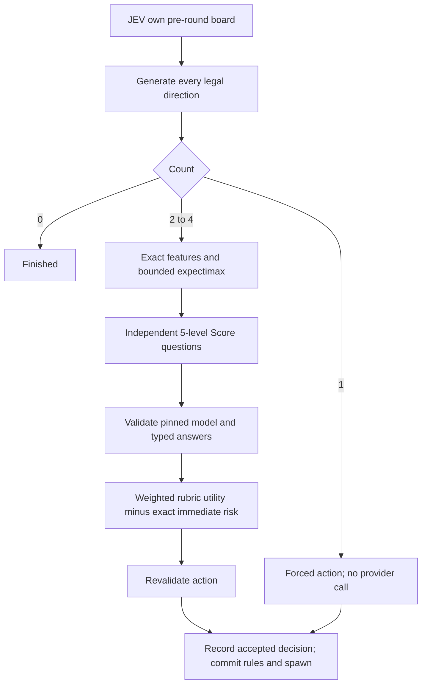
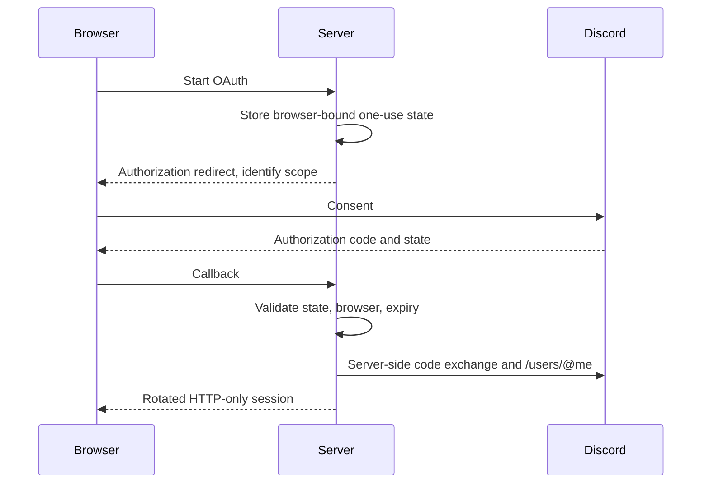
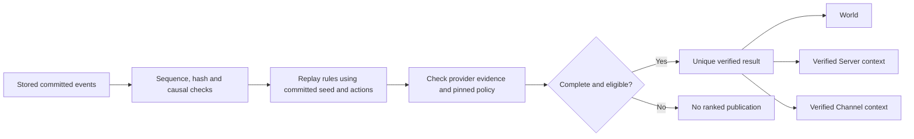

# Architecture and protocol

## Runtime and trust

The native Node server is the zero-install local entry point. The Worker adapter invokes the same API with D1-shaped storage and Static Assets. No persistent connection or background match runner is needed. Additional games could reuse auth, context and persistence, but no general plugin framework was introduced.

## Rules and chance

`rules.js` uses sixteen exponent cells and numeric actions UP=0, RIGHT=1, DOWN=2, LEFT=3. Every state transition is immutable and accepts an explicit spawn event. The score is the sum of resulting merged tile values. No UI or provider state can change a legal transition.

Two initialization events create identical boards. Subsequent spawn events are derived from HMAC-SHA-256 using domain-separated initialization/move indices and value/position streams. Rejection sampling avoids modulo bias; a Fisher–Yates permutation supplies a uniform ordering of all cells. Each board uses its first vacant cell in that ordering. Randomness is correlated between boards while its marginal distribution remains conventional for each board.

The commitment binds the complete manifest and a random 256-bit seed. AES-GCM protects the stored seed under a host key. Active public snapshots contain only a commitment, not future spawn values. Both directions are fixed before the current spawn is materialized. After an inactive terminal/resigned/expired match, its owner can export the seed for audit; no further move is accepted into that match.

## Decision loop

Profile dimensions and weights: Easy merge=1; Normal merge=.6/space=.4; Hard and JEV merge=.5/space=.3/anchor=.2. Normalize model scores by 4, sum weighted scores, then subtract twice the exact immediate spawn-block probability. Stable tie order is UP, RIGHT, DOWN, LEFT.

Depth budgets are 0/1/2/3 additional decisions; aggregate admitted-state budgets are 0/512/4096/16384, equally floor-divided among legal root moves. Every enumerated chance outcome retains its probability mass, even at a frontier. The baseline heuristic is `4*emptyFraction + monotonicity + cornerFlag - roughness`, with -10 for a blocked board and a logarithmic merge reward in lookahead. Bounded subtree traversal may truncate unevenly within a root; every root still has the same assigned ceiling. These initial settings are experimental, not demonstrated optimal difficulty ordering.

Local fallback sorts immediate risk, empty count, expected legal moves, corner preservation, roughness, immediate merge gain and direction ID. Its source is never `jev`.

## Round transaction

1. Check session ownership, active status, expiry, revision, legal human move, request ID, and quotas.
2. Compare-and-swap a short lease and persist the pending human action. A retry cannot replace it.
3. Append a reservation event; link feature/provider/decision events to it. Provider request evidence is durable before dispatch.
4. On a recoverable provider error, retain pending input and release the lease. Retry the same input or explicitly become local/unranked.
5. Derive the hidden spawn, apply the shared rules, prepare exact analytics facts, and append the committed round together with the new authoritative state and idempotency record.
6. On completion, replay from the seed and recorded decisions. Publish a unique result only after verification.

The database event insertion includes a lease-validity subquery into a NOT NULL foreign-key field, so a missing guard is an actual SQL failure. A zero-row UPDATE alone would not roll back a transactional batch. Duplicate request IDs with the same action return the current authoritative snapshot without applying another move; reusing an ID for a different action fails. A crashed/expired lease can be resumed; only the holder can commit.

## Identity and context

A separate signature-verified `/2048` interaction establishes approved guild/text-channel context. Its five-minute launch token carries user, guild, channel and nonce, signed by the host. Browser login must match the invoking account. Token consumption is one-use; a fifteen-minute context grant allows launching a new community-attributed ranked match. Attribution is frozen at creation. No arbitrary browser guild/channel ID is authoritative.

## Verification and publication

Replay does not rerun JEV. It validates recorded response linkage, scores/probabilities, utility and selected action against the pinned policy, while the rules independently verify all movement, merges, spawns and scores. It does not cryptographically prove that a provider really emitted a response or certify external-solver-free human play.

Current profile validation must remain available to replay old bundles. If changing rules, RNG, model semantics or policy configuration, introduce a new version and keep the old verifier or archive its source build. Never reinterpret existing matches using silently changed parameters.

## Main endpoints

| Endpoint | Function |
|---|---|
| `GET /api/health`, `GET /api/me` | Health and session/capability/history bootstrap |
| `GET /api/auth/discord[/callback]`, `POST /api/logout` | Identity lifecycle |
| `POST /api/discord/interactions`, `POST /api/context` | Signed community launches |
| `POST /api/matches` | Create a server-owned duel |
| `GET /api/matches/:id` | Resume authoritative state |
| `POST /api/matches/:id/step` | `{requestId, expectedRevision, humanAction}` |
| `POST /api/matches/:id/control` | Explicit `resign` or `continue_practice` |
| `GET /api/matches/:id/events?after=N` | Paged evidence |
| `GET /api/matches/:id/bundle[?format=jsonl]` | Streamed full JSON bundle or journal |
| `GET /api/matches/:id/verify` | Streaming offline-style server verification |
| `GET /api/matches/:id/analytics` | Full derived JSON, or CSV via `format=csv&table=rounds|candidates|cells` |
| `POST /api/matches/:id/telemetry` | Bounded, opt-in, untrusted timings |
| `GET /api/leaderboards` | Scoped, versioned, paged best-score table |
| `GET /api/admin/analytics` | Bearer-protected aggregate operational counts |

There is no arbitrary prompt proxy or browser-authoritative score submission endpoint. All match evidence endpoints enforce ownership. World display exposes only the intended public display name and result fields, not private community identifiers.
